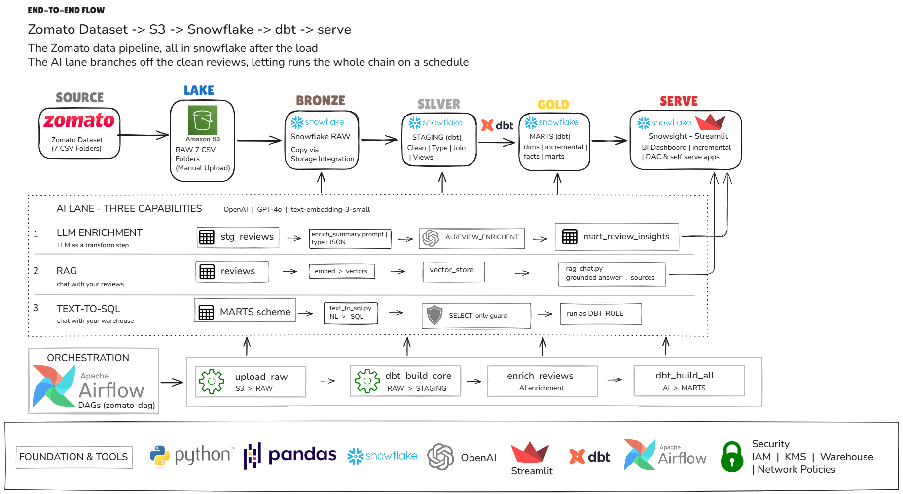
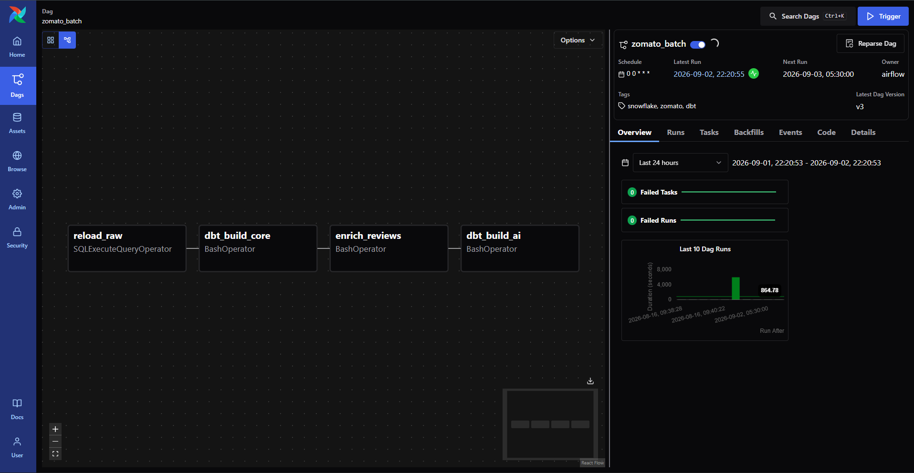
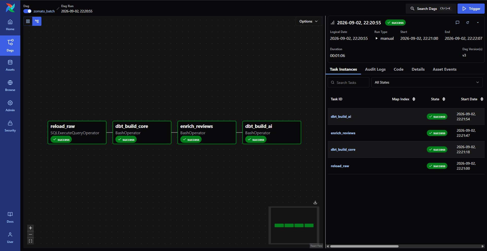
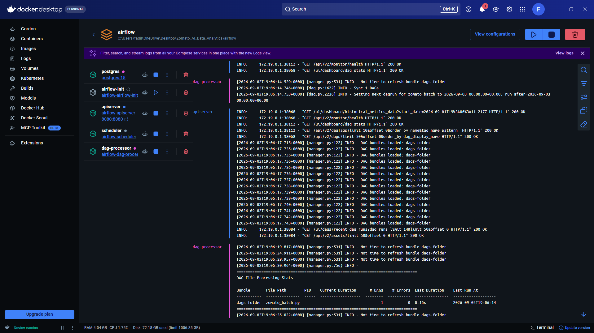

# Zomato AI Data Engineering

An end-to-end batch data pipeline that takes food-delivery data from raw CSVs to AI-powered analytics — built on **Amazon S3, Snowflake, dbt, Apache Airflow** and a **local LLM stack**.

Ten million orders land in a data lake, flow into a Snowflake medallion warehouse, get modelled and tested with dbt, and are served through three AI applications: LLM enrichment, retrieval-augmented chat over customer reviews, and natural-language querying of the warehouse. Apache Airflow runs the whole thing as one daily DAG.



---

## Table of contents

- [What this project does](#what-this-project-does)
- [Tech stack](#tech-stack)
- [Dataset](#dataset)
- [Architecture](#architecture)
- [Repository structure](#repository-structure)
- [The pipeline](#the-pipeline)
- [The AI layer](#the-ai-layer)
- [Orchestration](#orchestration)
- [Running it locally](#running-it-locally)
- [Data quality](#data-quality)
- [Known limitations](#known-limitations)
- [Roadmap](#roadmap)

---

## What this project does

Two design decisions shape everything else.

**ELT, not ETL.** Raw data is loaded into the warehouse first and transformed there. Snowflake's compute is elastic and cheap, so transformation logic lives in version-controlled SQL rather than in a brittle pre-load script.

**Batch, not streaming.** Food-delivery analytics answer daily questions — GMV, cancel rate, SLA breaches. A daily DAG is the honest fit for that; streaming would add cost and operational complexity the problem does not call for.

On top of the warehouse sits an AI layer built on a single idea: **an LLM is just another transformation step.** Review text goes in, structured columns come out, they land in a table, and dbt models that table like any other source. No special AI infrastructure.

---

## Tech stack

| Layer | Technology |
|---|---|
| **Lake** | Amazon S3 |
| **Warehouse** | Snowflake (`ZOMATO` — RAW / STAGING / MARTS / AI) |
| **Transformation** | dbt (`dbt-snowflake`) |
| **Orchestration** | Apache Airflow 3, Docker Compose |
| **AI — embeddings** | `nomic-embed-text` via Ollama |
| **AI — RAG answers** | `llama3.2:3b` via Ollama |
| **AI — text-to-SQL** | `qwen2.5-coder:7b` via Ollama |
| **Serving** | Streamlit |
| **Language** | Python, Pandas |

The AI layer runs entirely on **local models through Ollama** using an OpenAI-compatible endpoint. Nothing leaves the machine and there is no per-query cost. Because the client is OpenAI-compatible, switching to a hosted provider is a change of `base_url` and `MODEL`, not a rewrite.

---

## Dataset

| Table | Volume |
|---|---|
| `orders` | 10,000,000 rows |
| `order_items` | ~23,000,000 rows |
| `reviews` | 300,000 free-text reviews |
| `restaurants`, `users`, `food`, `menu` | dimension files |
| **Total** | **~2.3 GB of CSV** |

> The `Data/` directory is **not committed** — it is far past GitHub's file-size limits. Place the seven CSVs there locally before running the loader.

The volume is the point. At ten million rows a full rebuild on every run stops being acceptable, which is what forces the fact tables to be incremental. And 300,000 reviews are unstructured text that no amount of SQL turns into a metric, which is what creates the need for an AI layer.

Dataset Link - (https://drive.google.com/drive/folders/1FEnGWMHhHzzTUCZOw1-YnH2v3DMuM-rs)

---

## Architecture

| Layer | Location | Contents |
|---|---|---|
| **Source** | `Data/` (local) | Seven CSVs — four dimensions, three facts |
| **Lake** | Amazon S3 | One bucket, `raw/<table>/` per file |
| **Bronze** | `ZOMATO.RAW` | `COPY INTO` from S3 via a keyless storage integration |
| **Silver** | `ZOMATO.STAGING` | Seven dbt views — clean, cast, rename every source |
| **Gold** | `ZOMATO.MARTS` | Dimensions, incremental facts, four business marts |
| **AI** | `ZOMATO.AI` | LLM-enriched reviews (sentiment, topic, key issue) |

### Why keyless ingestion

Snowflake reads the S3 bucket with **no stored AWS keys**, using a storage integration paired with an IAM role. The handshake:

1. An IAM policy grants read-only access to the bucket.
2. A Snowflake `STORAGE INTEGRATION` points at the IAM role ARN.
3. `DESC INTEGRATION` returns Snowflake's IAM user ARN and an external ID.
4. Both are pasted back into the role's trust policy.

Two things that cost real time to learn: the trust policy `Principal` must be Snowflake's IAM user ARN and **not** the account root, and re-running `CREATE OR REPLACE` on the integration regenerates the external ID, silently breaking the trust relationship you already configured.

---

## Repository structure

```
├── ai/                                # AI layer
│   ├── enrich_reviews.py              #   LLM enrichment → ZOMATO.AI.REVIEW_ENRICHED
│   ├── rag_chat.py                    #   RAG — "chat with your reviews" (Streamlit)
│   ├── text_to_sql.py                 #   Text-to-SQL — "chat with your warehouse" (Streamlit)
│   └── review_embeddings.parquet      #   Cached review embeddings
│
├── airflow/                           # Airflow 3 on Docker
│   ├── Dockerfile                     #   Snowflake provider, dbt in an isolated venv
│   ├── docker-compose.yaml            #   postgres + api-server + scheduler + dag-processor
│   └── dags/zomato_batch.py           #   The pipeline DAG (4 tasks)
│
├── zomato/                            # dbt project
│   ├── models/staging/                #   7 staging views (Silver) + sources + tests
│   ├── models/marts/                  #   Dimensions, incremental facts, business marts (Gold)
│   ├── macros/                        #   Custom schema-name macro
│   └── dbt_project.yml
│
├── Screen_Shots_Output/               # Output screenshots (see below)
├── Workflow.png                       # Architecture diagram
├── Food-Tech_AI_Data_Engineering.pptx # Project presentation
└── requirements.txt
```

---

## The pipeline

### 1 · Silver — cleaning the mess

One dbt view per source. This is where real-world data stops being embarrassing:

| Problem | What it looks like | The fix |
|---|---|---|
| Placeholder text | A dash where a number belongs | `NULLIF` turns it into a real `NULL` |
| Currency strings | Rupee symbols inside a price column | `REGEXP_SUBSTR` extracts the digits |
| Untrusted numbers | Free text in a numeric field | `TRY_TO_DECIMAL` returns `NULL` instead of failing the run |
| Inconsistent casing | Emails stored in mixed case | `LOWER` makes joins behave |

The principle: **land data tolerantly, then enforce types where failures are visible and testable.** A bad row should surface in a dbt test, not crash a `COPY INTO` at 2 a.m.

### 2 · Gold — dimensions and facts

**Dimensions** — `dim_restaurants`, `dim_customer` (with derived age segments), `dim_food`, and `dim_date`, a generated calendar spine.

The date spine earns its place: `GROUP BY order_date` silently drops days with zero orders, and a chart built on that quietly lies. One row per calendar day fixes it.

**Facts** — `fct_orders` and `fact_order_items` are materialised `incremental` with a **MERGE** strategy, so a re-run processes only new records rather than rebuilding ten million rows. MERGE is also what makes the task **idempotent**, which is what makes Airflow's automatic retries safe. A non-idempotent task plus auto-retry is data corruption on a schedule.

### 3 · Marts — one per business question

| Mart | Answers |
|---|---|
| `mart_daily_city_revenue` | GMV, average order value and cancel rate by city and day |
| `mart_restaurant_performance` | Orders, revenue and average rating per restaurant |
| `mart_delivery_sla` | p50 and p90 delivery time by city and hour |
| `mart_review_insights` | Sentiment and topic counts from the LLM-enriched table |

Two details worth noting. `DIV0` guards the cancel-rate calculation so a zero-order day cannot crash the run. And delivery SLA uses **percentiles rather than averages** — a mean delivery time hides the worst experiences, while p90 is the number a customer actually feels.

Because each metric is defined once in dbt, every consumer — dashboard, notebook or LLM — gets the same number.

---

## The AI layer

### 1 · LLM enrichment

`ai/enrich_reviews.py` reads reviews that have not yet been classified, asks a local model for `sentiment_label`, `sentiment_score`, `topic` and `key_issue`, and writes the result to `ZOMATO.AI.REVIEW_ENRICHED`. dbt then models that table into `mart_review_insights` like any other source.

The model is forced to reply in **strict JSON** — prose is unparseable, and demanding a schema is what makes model output loadable. The job is **idempotent and sample-capped**: already-classified reviews are skipped, so a re-run never repeats work.

### 2 · RAG — chat with your reviews

`ai/rag_chat.py` embeds review text once and caches it to Parquet, embeds the incoming question with the same model, selects the five closest reviews by cosine similarity, and answers using only those as context.


Every answer ships with **the reviews that produced it**. That turns an answer into evidence — a claim you can trace back to a specific row is worth more than a fluent paragraph you cannot check. It also makes the failure mode obvious: if the retrieved rows are irrelevant, retrieval is the problem, not the model.


### 3 · Text-to-SQL — chat with your warehouse

`ai/text_to_sql.py` gives a code-specialised model the mart schema, asks for one Snowflake `SELECT`, validates it, runs it, and charts two-column results automatically.


**Defence in depth.** The generated query must begin with `SELECT` or `WITH` and is rejected if it contains a data-modifying keyword. It then executes as `DBT_ROLE`, which holds no write grants — so even a query that slipped past the check could not change anything.

The two apps answer different questions on purpose. *"What do customers complain about?"* is a review question and goes to RAG. *"Which city has the worst delivery times?"* is a warehouse question and goes to text-to-SQL. Retrieval over review text cannot aggregate across ten million orders, and SQL cannot read sentiment out of free text.

---

## Orchestration

One daily DAG, four tasks, one dependency chain:

```
reload_raw  →  dbt_build_core  →  enrich_reviews  →  dbt_build_ai
(COPY from S3)  (dbt build + tests)  (LLM enrichment)   (AI mart)
```



The split is driven by a single dbt tag. Core models build and test first with `--exclude tag:ai`; the LLM then enriches the freshly loaded reviews; and only the AI-tagged mart rebuilds with `--select tag:ai`.



Airflow runs on Docker Compose — Postgres, API server, scheduler and DAG processor. dbt lives in **its own virtualenv inside the image**, because Airflow and dbt have conflicting Python dependencies; Airflow shells out to it rather than importing it.



Credentials never touch the code. Compose injects `SNOWFLAKE_*` environment variables, which dbt's `profiles.yml` reads through `env_var()`.

---

## Running it locally

### Prerequisites

- Python 3.11+
- Docker Desktop
- A Snowflake account
- An AWS account with an S3 bucket
- [Ollama](https://ollama.com) running locally

### 1 · Environment

```bash
python -m venv .venv
source .venv/bin/activate          # Windows: .venv\Scripts\Activate.ps1
pip install -r requirements.txt
```

### 2 · Local models

```bash
ollama pull nomic-embed-text       # embeddings for RAG
ollama pull llama3.2:3b            # RAG answers, review enrichment
ollama pull qwen2.5-coder:7b       # text-to-SQL
```

### 3 · Snowflake and S3

Create the warehouse, database, schemas and role; set up the storage integration, external stage and RAW table DDL; then upload the CSVs to `s3://<bucket>/raw/<table>/` and run `COPY INTO`.

### 4 · Credentials

Set these as environment variables, or place them in `ai/.env` and `airflow/.env`:

```
SNOWFLAKE_ACCOUNT=
SNOWFLAKE_USER=
SNOWFLAKE_PASSWORD=
SNOWFLAKE_WAREHOUSE=ZOMATO_WH
SNOWFLAKE_DATABASE=ZOMATO
```

> **Never commit `.env` files or `profiles.yml`.** `profiles.yml` should read every credential through `env_var()`.

### 5 · Build the warehouse

```bash
cd zomato
dbt debug --profiles-dir .
dbt build --exclude tag:ai --profiles-dir .
```

### 6 · Run the AI layer

```bash
cd ai
python enrich_reviews.py           # enrich reviews, then: dbt build --select tag:ai
streamlit run rag_chat.py          # chat with your reviews
streamlit run text_to_sql.py       # chat with your warehouse
```

### 7 · Orchestrate

```bash
cd airflow
docker compose build && docker compose up -d
```

Airflow UI at `http://localhost:8080` — un-pause `zomato_batch` and trigger it.

---

## Data quality

`dbt build` runs models and tests together in dependency order, so a failing test stops the DAG before bad data reaches anything downstream.

| Test | Catches |
|---|---|
| `unique` | Duplicate `order_id` — an immediate signal that an incremental MERGE has broken |
| `not_null` | Missing keys and foreign keys |
| `relationships` | A `restaurant_id` in the fact table with no matching dimension row |
| `accepted_values` | An `order_status` the marts were never designed to handle |

---

## Known limitations

Stated plainly, because they are real:

- **The embedding cache invalidates on nothing.** New reviews will not appear in RAG results until the Parquet cache is rebuilt.
- **Text-to-SQL sees only the mart tables.** Item-level questions cannot be answered even though `fact_order_items` exists in the warehouse.
- **The SQL safety guard matches substrings rather than parsing.** It correctly blocks data-modifying statements, but also rejects harmless queries containing words like `created_at`. Proper SQL parsing is the real fix.
- **Enrichment is sample-capped.** A cost control by design, but it means clearing a 300,000-review backlog would take many runs.
- **A 3B model writes imperfect SQL.** Dialect mistakes are the common failure — Snowflake does not implicitly cast `BOOLEAN` to a number, so idioms borrowed from MySQL or Postgres fail. Few-shot examples in the system prompt are the durable fix.

---

## Roadmap

- An SCD2 snapshot to track restaurant attributes changing over time
- Singular tests — delivery timestamp never before order timestamp, daily GMV never negative
- Cohort and retention marts built on the existing dimensions
- A Streamlit BI dashboard over the marts, alongside the two AI apps
- Item-level tables added to the text-to-SQL schema prompt

---

## Presentation

A condensed walkthrough of the architecture and design decisions is available as [`Food-Tech_AI_Data_Engineering.pptx`](Food-Tech_AI_Data_Engineering.pptx).

---

## Author

**Fadil Ahmed**

Additional query outputs for both AI applications — covering delivery, food quality, packaging, pricing and sentiment analysis — are in [`Screen_Shots_Output/`](Screen_Shots_Output/).
